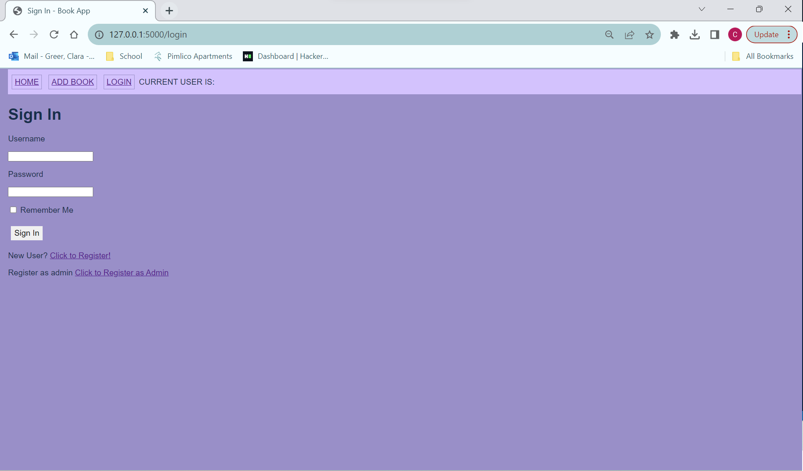

# Design Document

## Book App
--------
Prepared by:

* `Clara Greer`,`WSU CPTS Student`
* `Tyler Lighthall`,`WSU CPTS Student`
* `Cristobal Escobar`,`WSU CPTS Student`
---

**Course** : CptS 322 - Software Engineering Principles I

**Instructor**: Sakire Arslan Ay

---

## Table of Contents
- [Design Document](#design-document)
  - [Your Project Title](#your-project-title)
  - [Table of Contents](#table-of-contents)
    - [Document Revision History](#document-revision-history)
- [1. Introduction](#1-introduction)
- [2.	Architectural and Component-level Design](#2architectural-and-component-level-design)
  - [2.1 System Structure](#21-system-structure)
  - [2.2 Subsystem Design](#22-subsystem-design)
    - [2.2.1 Model](#221-model)
    - [2.2.2 Controller](#222-controller)
    - [2.2.3 View and User Interface Design](#223-view-and-user-interface-design)
- [3. Progress Report](#3-progress-report)
- [4. Testing Plan](#4-testing-plan)
- [5. References](#5-references)
- [Appendix: Grading Rubric](#appendix-grading-rubric)

### Document Revision History

| Name | Date | Changes | Version |
| ------ | ------ | --------- | --------- |
|Revision 1 |2021-10-05 |Initial draft | 1.0        |
|      |      |         |         |
|      |      |         |         |

# 1. Introduction

This design document will show the blueprint for the Book App.

This project is the Book App, an app where users can read and write reviews for their favorite books.

At the end of the introduction, provide an overview of the document outline.

[Section II](#2-architectural-and-component-level-design) includes …

[Section III](#22-subsystem-design) includes …

# 2.	Architectural and Component-level Design
## 2.1 System Structure

  
1. Routes
   Role:
   - Create new forms and redirects and displays html pages.
  
2. Authorization Routes
   Role:
   - Create new authorization forms for admin and regular users and redirects and displays login and register html pages.

3. Forms
   Role:
   - Creates forms for new books and new reviews.
  
3. Authorization Forms
   Role:
   - Creates forms for registration and login for users.
   
* Discuss the rationale for the proposed decomposition in terms of  coupling and re-use.

This section should describe the high-level architecture of your software:  i.e., the major subsystems and how they fit together. 
If you adopted the application structure we used in the Smile App, your application would have the Model-View-Controller (MVC) pattern. If you adopted a different architectural pattern, mention the pattern you adopted in your software and briefly discuss the rationale for using the proposed architecture (i.e., why that pattern fits well for your system).

## 2.2 Subsystem Design 

(**Note2**: You should describe the design for the end product (completed application) - not only your iteration1 version. You will revise this document in iteration-2 and make changes  and/or add more details in iteration-2.)

### 2.2.1 Model

Briefly explain the role of the model. 

1. Review
  Role:
  - Represents user reviews for books.
  Attributes:
    - id (Primary Key): An integer representing the unique identifier for each review.
    - title: A string (up to 150 characters) for the title of the review.
    - body: A string (up to 1500 characters) for the review content.
    - timestamp: A DateTime field that stores the review's creation timestamp.
    - likes: An integer representing the number of likes on the review.

2. User
  Role:
  - Represents user accounts in the application.
  Attributes:
    - id (Primary Key): An integer representing the unique identifier for each user.
    - username: A string (up to 64 characters) for the user's username.
    - email: A string (up to 120 characters) for the user's email address.
    - password_hash: A string (128 characters) for storing the hashed password.
    - Relationship:
      - review: A relationship with the Review table will be added, not defined yet.

3. Regular_User
  Role:
  - Represents a regular user accounts in the application.
  Attributes: (inherited from User) 
    - id (Primary Key): An integer representing the unique identifier for each user.
    - username: A string (up to 64 characters) for the user's username.
    - email: A string (up to 120 characters) for the user's email address.
    - password_hash: A string (128 characters) for storing the hashed password.
    - Relationship:
      - review: A relationship with the Review table will be added, not defined yet.

4. Admin
  Role:
  - Represents an admin account in the application.
  Attributes: (inherited from User) 
    - id (Primary Key): An integer representing the unique identifier for each user.
    - username: A string (up to 64 characters) for the user's username.
    - email: A string (up to 120 characters) for the user's email address.
    - password_hash: A string (128 characters) for storing the hashed password.
    - Relationship:
      - review: A relationship with the Review table will be added, not defined yet.

5. Book
  Role:
  - Represents books and their details.
  Attributes:
    - id (Primary Key): An integer representing the unique identifier for each book.
    - title: A string (up to 150 characters) for the book's title.
    - author: A string (up to 30 characters) for the book's author.
    - year: An integer representing the year of the book (foreign key to the Year table).
    - timestamp: A DateTime field that stores the book's creation timestamp.
    - genres: An array of genres from the genre table.
    - Relationships:
      - reviews: A many-to-many relationship with the Review table, defined through the reviewBook association table.
      - genres. A many-to-many relationship with the Genre table, defined through an association table.

6. Year
  Role:
  - Represents years in which books were published.
  Attributes:
    - id (Primary Key): An integer representing the unique identifier for each year.
    - year: An integer representing the year.
    - Relationships:
    - books: A one-to-many relationship with the Book table, allowing multiple books to be associated with a specific year.

7. Genre
  Role: 
    - Represent book genres.
  Attributes:
      - id (Primary Key): An integer representing a book genre.
      - name: A string representing the name of the genre.
      - roster: A roster of all the genres ro a book
      - Relationships:
        - genres. A many-to-many relationship with the Genre table, defined through an association table.

8. Roster
  Role:
    - Association table for genres to books.
  Attributes:
    - bookid (Primary Key): An integer representing a book id.
    - genreid (Primary Key): An integer representing a genre id.
    - bookgenres: A relationship with Book.
    - genres: A relationship with Genre.

### 2.2.2 Controller

Briefly explain the role of the controller. If your controller is decomposed into smaller subsystems (similar to the Smile App design we discussed in class), list each of those subsystems as subsections. 

For each subsystem:
 * Explain the role of the subsystem (component) and its responsibilities.
 * 	Provide a detailed description of the subsystem interface, i.e., 
    * which other subsystems does it interact with?  
    * what are the interdependencies between them? 

**Note:** Some of your subsystems will interact with the Web clients (browsers). Make sure to include a detailed description of the routes your application will implement. For each route specify its “methods”, “URL path”, and “a description of the operation it implements”.  
You can use the following table template to list your route specifications. 

(***in iteration-1***) Brainstorm with your team members and identify all routes you need to implement for the completed application and explain each route briefly. If you included most of the major routes but you missed only a few, it maybe still acceptable. 

routes subsystem:
  - This subsystem primarily deals with routes related to the main functionality of the application, including managing books, reviews, and user interactions.

  index Route:
    URL Path: / and /index
    Method: GET
    Description: Renders the main index page of the application, displaying books and allowing users to interact with them. It fetches a list of books and passes them to the template.

  postReview Route:
    URL Path: /postreview<book_id>
    Methods: GET and POST
    Description: Handles the creation of reviews for a specific book. It takes a book ID as a parameter, retrieves the book, and allows users to submit reviews for that book.

  addbook Route:
    URL Path: /addbook
    Methods: GET and POST
    Description: Allows users to add new books to the system. It handles the form submission and book creation, displaying a form for entering book details.

  reviews Route:
    URL Path: /reviews<book_id>
    Method: GET
    Description: Displays reviews for a specific book. Users can see the reviews associated with a book.

  like Route:
    URL Path: /like/<review_id> <book_id>
    Method: POST
    Description: Handles the process of liking a review. It increments the like count for a review and redirects back to the reviews page for the associated book.

bp_auth Subsystem:
  - This subsystem is responsible for user authentication and registration.

  admin_registration Route:
    URL Path: /admin_registration
    Methods: GET and POST
    Description: Handles the registration of admin users. It allows admins to create accounts, setting the user type to "Admin."
    regular_registration Route:

  URL Path: /regular_registration
    Methods: GET and POST
    Description: Handles the registration of regular users. It allows regular users to create accounts, setting the user type to "Reg_User."

  login Route:
    URL Path: /login
    Methods: GET and POST
    Description: Handles user login. Users can enter their credentials to log in. If successful, they are redirected to the main index page.

  logout Route:
    URL Path: /logout
    Methods: GET and POST
    Description: Allows users to log out of their accounts. After logging out, users are redirected to the main index page.

(***in iteration-2***) Revise your route specifications, add the missing routes to your list, and update the routes you modified. Make sure to provide sufficient detail for each route. In iteration-2, you will be deducted points if you don’t include all major routes needed for implementing the required use-cases or if you haven’t described them in detail.

### 2.2.3 View and User Interface Design 

The view of Book App will be used to give users easy access to all the features of the Book App. We right now are just using the HTML frameworks, but soon will use Bootstrap to create a clean UI.

Provide a list of the page templates you plan to create (or you already created). Briefly describe the information that will be displayed on those pages and the forms that will be rendered (i.e., explain the input and output for each page). Make sure to mention which use-cases in your “Requirements Specification” document will utilize these interfaces for user interaction. You can supplement your description with UI sketches or screenshots. 

***Templates:***
  1. base.html
    - This is the base for all of the templates to be extended off of. 
    - This displays the header with buttons (login, logout, add book, and home) and the current user.  
  2. index.html
    - This creates the home page, which uses the _book.html to display all of the books in the library.
  3. login.html
    - This uses the login form to let users with existing accounts log in, and users without accounts can register using the register button below the login form.
  4. register.html
    - This uses the registration form to let anyone create an account.
  5. admin_registration.html
    - This uses the admin registration form to let an admin create an account.
  6. _book.html
    - This lists all the books on the page, giving the option for the user to create a review for a specific book or to look at the reviews of a specific book. When selected those links you get redirected to the _review.html(to look at existing reviews) or create.html(to create a new review).
  7. _review.html
    - This lists all the reviews of a specific selected book for user to read, and where a logged in user can choose to like a review.
  8. create.html
    - This lets a logged in user create a review for the specific book using the review form. 
    - If user is not logged in, page will redirect back to the previous page with a flash message telling user to create an account or login to create a review. 
  9. add_book.html
    - This lets an admin add a new book to the library using the book form.
  10. 404error.html
  11. 500error.html
  12. display_profile.html
    - This page shows all the user information and reviews, and allow user to edit any of the information.
  13. edit_profile.html
    - This page allows the user to edit their info.
  13. user friends (not implemented yet)
    - This page will display current friends and an option to search and add new friends.

(***in iteration-1***) Brainstorm with your team members and identify the pages that you think should be created.  If you included most of the major pages, it will be acceptable. 

(***in iteration-2***) Revise your page list and descriptions and include any additional pages that you will include in your view.  In iteration-2, you will be deducted points if your view description is still superficial and doesn't list and explain all pages of your application. 

# 3. Progress Report

Write a short paragraph summarizing your progress in iteration1 / iteration2.

***in iteration 1**
In iteration 1 BookWorms have implemented the bare bones of the Book App. This includes the functions: to add books or add a review to specific books; register as an admin or register as a regular user; log in and out; and liking reviews. We started to create a coherent theme for the view, but that is still in progress, along with making the admin exclusive actions only available to admins. Upcoming problems to tackle are adding genres to books and the action top sort books and reviews.

***in iteration 2**
In iteration 2 Bookworms have implemented the following: preventions for non-users posting and adding books and regular users adding books; regular users can delete their previous posts and admins and delete any post; added a genres to book relationship, this is for users to have other books recommended to them potentially; added a display profile page for when a user or admin logs in. Theme for the view is still in progress, this is part of the upcoming agenda to polish off the UI, along with search, recommended genres, and testing.

# 4. Testing Plan

(***in iteration 2***)
In this section , provide a brief description of how you plan to test the system. Thought should be given to  mostly how automatic testing can be carried out, so as to maximize the limited number of human hours you will have for testing your system. Consider the following kinds of testing:
  * *Unit Testing*: Explain for what modules you plan to write unit tests, and what framework you plan to use.  (Each team should write automated tests (at least) for testing the routes)
  * *Functional Testing*: How will you test your system to verify that the use cases are implemented correctly? 
  * *UI Testing*: How do you plan to test the user interface?  (Manual tests are OK)

# 5. References

Cite your references here.

For the papers you cite give the authors, the title of the article, the journal name, journal volume number, date of publication and inclusive page numbers. Giving only the URL for the journal is not appropriate.

For the websites, give the title, author (if applicable) and the website URL.

