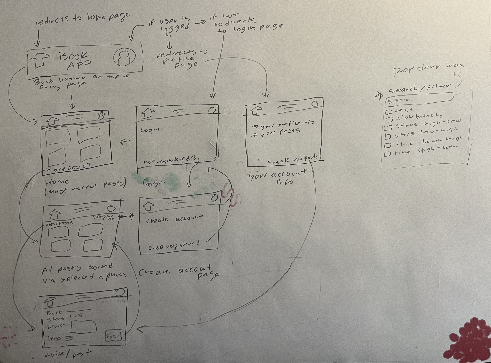

# Software Requirements Specification

## Book App
--------
Prepared by:

* `Clara Greer`,`WSU CPTS Student`
* `Tyler Lighthall`,`WSU CPTS Student`
* `Cristobal Escobar`,`WSU CPTS Student`

---

**Course** : CptS 322 - Software Engineering Principles I

**Instructor**: Sakire Arslan Ay

---

## Table of Contents
- [Software Requirements Specification](#software-requirements-specification)
  - [Book App](#book-app)
  - [Table of Contents](#table-of-contents)
  - [Document Revision History](#document-revision-history)
- [1. Introduction](#1-introduction)
  - [1.1 Document Purpose](#11-document-purpose)
  - [1.2 Product Scope](#12-product-scope)
  - [1.3 Document Overview](#13-document-overview)
- [2. Requirements Specification](#2-requirements-specification)
  - [2.1 Customer, Users, and Stakeholders](#21-customer-users-and-stakeholders)
  - [2.2 Use Cases](#22-use-cases)
  - [2.3 Non-Functional Requirements](#23-non-functional-requirements)
- [3. User Interface](#3-user-interface)
- [4. Product Backlog](#4-product-backlog)
- [4. References](#4-references)
- [Appendix: Grading Rubric](#appendix-grading-rubric)

## Document Revision History

| Name | Date | Changes | Version |
| ------ | ------ | --------- | --------- |
|Revision 1 |2023-10-05 |Initial draft | 1.0        |
|      |      |         |         |
|      |      |         |         |

----
# 1. Introduction

This document will outline all of the requirements for the Book App.

## 1.1 Document Purpose

The purpose of this Software Requirement Specification document is to clearly outline and document the creation of the Book App.

## 1.2 Product Scope

The Book App is an app that lets a user post and read reviews about their favorite (or not so favorite) books. Users can share their ideas about books they read by posting reviews, or read others opinions on books and decide to like those reviews if they agree. This will be helpful for other bookworms by being able to: to see what their fellow users think about a book and help decide if they want to read that book; meet other people with similar interests in books; and the user could even use this app as a personal log of all the books they read. The goal is bring bookworms together and encourage community and reading!

## 1.3 Document Overview

This document includes the specific requirements, an overlay of all the use cases, and other general information important to the implementation to the Book App; all of which organized in their own tables and sections.

----
# 2. Requirements Specification

* Login/logout 
  * Two types of accounts can log in (admin or user).
  * If a user doesn't have an account they can get directed to an create account.
* Register account
  * Create either a user or admin account.
  * Must input an original username and email to register account.
* Book Reviews
  * Create a review
    * A user can create a review an already established book, or add a new book to the book app library.
    * A review must have a book to be a review of and a rating from five stars.
      * A review can also include a small paragraph or tags but are not required. 
    * Must be a logged in user to create a review.
  * Review interactions
    * Only logged in users can interact with other posted reviews, but anyone can still look at the reviews. (i.e. A user doesn't need to be logged in to read reviews)
    * Interacting includes: commenting and liking. 
    * Users can delete their own posts at any time, admins can delete anyone's post at anytime. 
  * Search/filter
    * Reviews can be searched for by existing books in the library, by key words, or tags.
    * The reviews can also be filtered by time/date, alphabetically, book, star-rating, tags.

## 2.1 Customer, Users, and Stakeholders

The customer, stakeholders, and users are anyone who has an interest in reading; from the avid bookworm to someone who is just starting to get into reading.

----
## 2.2 Use Cases

Actors
- LIU   - A user logged in with a regular user account.
- NIU   - A user not logged in. 
- Admin - A user logged into an admin account

| Use case # 1      |  |
| ------------------|--|
| Name              | Post review  |
| Users             | LIU  |
| Rationale         | For a user to post a book review.  |
| Triggers          | When a LUI selects a create post button on the home, posts, or profile page.   |
| Preconditions     | User must be logged in.  |
| Actions           | Redirect to the create review page, user must select a book and star rating, then if they choose they can write a small review and add tags.  |
| Alternative paths | If the book the user wants to review isn't listed they will be prompted with adding a new one to the library.  |
| Postconditions    | The review will posted to the main page. User will be directed to the home page. |
| Acceptance tests  | When the review is posted it will be added to the user's posts and the book's reviews. (in the database)  |
| Iteration         | 1 (fully when login is implemented) |

| Use case # 2      |   |
| ------------------ |--|
| Name              | Add new book  |
| Users             | LUI, Admin  |
| Rationale         | If a desired book is not in the book app library, an admin or LUI can add it to the library.  |
| Triggers          | For LUI -> When creating a review if the desired book is not in the library they can choose to add it. For Admin -> when maintaining the cite, the admin can choose to add books to the library.   |
| Preconditions     | user must be logged in  |
| Actions           | The book requires the book title an author, then is added to the book library.  |
| Alternative paths | Admin path explained above.  |
| Postconditions    | New book is added to the library.  |
| Acceptance tests  | When a book is added, it is added to the database.  |
| Iteration         | 1 (fully when login is implemented)  |

| Use case # 3      |   |
| ------------------ |--|
| Name              | Homepage  |
| Users             | LIU, NIU, Admin  |
| Rationale         | To access the home page.  |
| Triggers          | When user presses the home button.  |
| Preconditions     | None, this can be done at any time.  |
| Actions           | Redirects user to the homepage.  |
| Alternative paths | None.  |
| Postconditions    | Displays homepage with most recent reviews.  |
| Acceptance tests  |   |
| Iteration         | 1 |

| Use case # 4      |   |
| ------------------ |--|
| Name              | Like review  |
| Users             | LIU  |
| Rationale         | To like a review.  |
| Triggers          | When pressing a reviews like button.  |
| Preconditions     | User must be logged in to like a review.  |
| Actions           | Updates a reviews like count and displays to page.  |
| Alternative paths | None.  |
| Postconditions    | Displays like count to page.  |
| Acceptance tests  | When like button is pressed, it should add one like to the review.  |
| Iteration         | 1 (fully when login is implemented)  |

| Use case # 5      |   |
| ------------------ |--|
| Name              | Login  |
| Users             | NIU  |
| Rationale         | For a user to interact with reviews or post their own they must log in.  |
| Triggers          | When pressing the profile button when not logged in.  |
| Preconditions     | No user is logged in. |
| Actions           | Redirect to log in page and prompt to log in. User can log in with username and password or register an account (see case #6). |
| Alternative paths | User registers an account, then logs in.  |
| Postconditions    | User logged in NIU -> LIU.  |
| Acceptance tests  | A value can be returned when user is correctly logged in.   |
| Iteration         | 2  |

| Use case # 6      |   |
| ------------------ |--|
| Name              | Create account  |
| Users             | NIN  |
| Rationale         | To interact with reviews and post a review a user has top log in, and to do that a user has to have a registered account.  |
| Triggers          | When selecting the register account hyperlink in the login page.  |
| Preconditions     | User cannot be logged in.  |
| Actions           | The user must input a unique email and username, then may choose to supply other information.  |
| Alternative paths | If user is registering as an admin they will specify with a dropdown box.  |
| Postconditions    | The account is registered and the user can then log in with it.  |
| Acceptance tests  | When the account is registered it will be added to the user database.  |
| Iteration         | 2  |

| Use case # 7      |   |
| ------------------ |--|
| Name              | Display profile  |
| Users             | LIU, Admin  |
| Rationale         | To look at all of the logged in profile information.  |
| Triggers          | when selecting the profile button as a logged in user or admin.  |
| Preconditions     | Must be logged in.  |
| Actions           | Re-directs to the user info page and displays current users info.  |
| Alternative paths | None.  |
| Postconditions    | Displays user information.  |
| Acceptance tests  | Displays correct user information.  |
| Iteration         | 2  |

| Use case # 8      |   |
| ------------------ |--|
| Name              | Logout  |
| Users             | LIU, Admin  |
| Rationale         | To log out of the cite  |
| Triggers          | When pressing the logout button in the display profile page.  |
| Preconditions     | Must be logged in to log out.  |
| Actions           | Logs out user and redirects them back to the home page.  |
| Alternative paths | None.  |
| Postconditions    | No current user will be logged in.  |
| Acceptance tests  | No current user should be shown as logged in.  |
| Iteration         | 2  |

| Use case # 9      |   |
| ------------------ |--|
| Name              | Filter posts  |
| Users             | LIU, NIU, Admin  |
| Rationale         | To look at posts sorted in a specific way.  |
| Triggers          | When selected from a dropdown box of filter options and submitted.  |
| Preconditions     | Must be on home page or reviews page.  |
| Actions           | Will redirect to review page with the reviews sorted in the selected fashion.  |
| Alternative paths | None.  |
| Postconditions    | Displayed sorted reviews.  |
| Acceptance tests  | Displayed correctly sorted reviews.  |
| Iteration         | 3  |

| Use case # 10      |   |
| ------------------ |--|
| Name              | Search  |
| Users             | LIU, NIU, Admin  |
| Rationale         | To look for specific reviews.  |
| Triggers          | User will type the a desired phrase and submit.  |
| Preconditions     | Must be on home page or reviews page.  |
| Actions           | Will redirect to review page with all the reviews that contain that phrase or word.  |
| Alternative paths | If no reviews match the given input, will redirect to reviews page with a flash message.  |
| Postconditions    | Displayed reviews containing desired phrase/word.  |
| Acceptance tests  | Displayed correct reviews.  |
| Iteration         | 3  |

| Use case # 11      |   |
| ------------------ |--|
| Name              | Edit Profile  |
| Users             | LIU, Admin  |
| Rationale         | To change details of user information.  |
| Triggers          | When selecting change info button.  |
| Preconditions     | Must be logged in and on profile information page.  |
| Actions           | User can edit all information (except username and email) and resubmit  |
| Alternative paths | None.  |
| Postconditions    | User will have new updated information displayed to the profile info page.  |
| Acceptance tests  | User data will be changed in the database.  |
| Iteration         | 3  |

| Use case # 12      |   |
| ------------------ |--|
| Name              | Delete review  |
| Users             | LIU, Admin  |
| Rationale         | To delete a post.  |
| Triggers          | When looking at your own reviews you can choose to delete a review.  |
| Preconditions     | Must be logged in and have access to own reviews whether that is though user info page, home page, or reviews page.  |
| Actions           | Deletes post from the database.  |
| Alternative paths | Admin can delete any post, does not have to be the user that posted it. This is to moderate the reviews.  |
| Postconditions    | The page will reload with the correct posts listed.  |
| Acceptance tests  | The post will no longer be in the database.  |
| Iteration         | 3  |

----
## 2.3 Non-Functional Requirements

1. [Usability]:  [Book App will be easy to navigate for any user.]
1. [Loadtime]:  [Book App will not take any longer than five seconds to load a page.]
1. [Scaleability]:  [Book App will be able to handle a thousand user at a time.]

----
# 3. User Interface

----
# 4. Product Backlog

https://github.com/WSU-CptS-322-Fall-2023/termproject-bookworms.git

10/11/23 - Completed Requirement Doc

----
# 4. References

----
----

